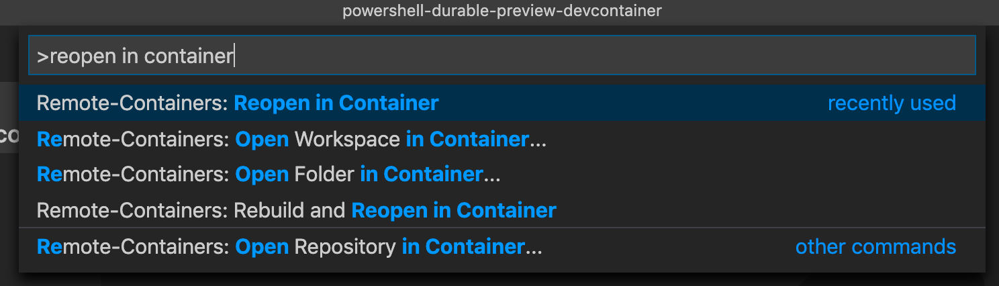

# QuickStart: PowerShell Durable Functions Alpha 🌩

Follow this guide to get up and running with PowerShell Durable Functions!

> **Note:** (2020-03-26) Because Durable Functions requires an updated version of the Azure Functions PowerShell worker that has not yet been deployed to Azure, you can get started using a dev container with Visual Studio Code Remote for Containers or Visual Studio Online.
>
> You'll be able to deploy to Azure in April.

## Prerequisites

* Azure subscription - Durable Functions requires a storage account. The easiest way to get started is by connecting to a storage account in Azure.
* An editor that supports Visual Studio dev containers
    - Visual Studio Code
        - Docker - your local machine must be set up to run Linux Docker containers
        - [Remote Development extension pack](https://marketplace.visualstudio.com/items?itemName=ms-vscode-remote.vscode-remote-extensionpack) - starts and connects to the dev container
    - Visual Studio Online
        - VS Online provides a development environment in the cloud that you can connect to using VS Code or VS Online's full-featured, browser-based code editor. 

## Instructions

### Start the development environment

Choose one of the following options and follow the instructions to create a development environment.

#### Option 1 - Visual Studio Code with Remote Development extension and Docker

1. Clone this repo to your computer.
1. Open the repo's folder in VS Code.
1. Using the Command Palette (press `F1` or `Ctrl-Shift-P` or `Cmd-Shift-P` (macOS)), search for and run the *Reopen in Container* command. VS Code will reopen, start the development environment in Docker, and connect to it.
    
    

#### Option 2 - Visual Studio Online

1. In a new browser window, open this magical link: [Open in Visual Studio Online](https://online.visualstudio.com/environments/new?name=PowerShell+Durable+Functions+Preview&repo=https://github.com/anthonychu/powershell-durable-preview)
1. If prompted, sign in.
1. A Create Environment dialog appears. Confirm the information and click *Create*. Wait a few minutes to create the environment.
1. Click *Connect* to open the VS Online in-browser code editor.

### Open the samples workspace

Each sample is in its own folder. All of the sample folders can be opened together in a workspace.

1. Using the Command Palette (press `F1` or `Ctrl-Shift-P` or `Cmd-Shift-P` (macOS)), search for and run the *Remote-Containers: Open Workspace in Container...* command. VS Code will reopen in the workspace.

### Explore a PowerShell Durable Functions app

Now that you have the workspace open, take a look at `FunctionChaining` sample app to see what's inside.

In the Explorer pane where the workspace is opened, expand the `FunctionChaining` folder.

In the folder, you'll find files for configuring the function app. There are three functions, each in its own folder:
* `FunctionChainingOrchestrator` - the main function that orchestrates activity functions
* `SayHello` - the activity function that is called by the orchestrator function
* `FunctionChainingStart` - an HTTP triggered function that creates and starts an *instance* of the orchestrator whenever it receives an HTTP request

### Run the function chaining sample

It's time to run your first PowerShell Durable Functions app.

1. Using the Command Palette again, search for and run the *Debug: Select and Start Debugging...* command. A list of function apps appear.
1. Select the `FunctionChaining` app.
1. Because no storage account was configured in `local.settings.json`, the Azure Functions VS Code extension should prompt you to select a storage account. Sign in to Azure and create a new storage account. You may also select an existing storage account that you have *not* used with Durable Functions.
1. Wait for the function app to start. Because it's your first time running it, it may take longer to acquire the necessary extensions and dependencies.
1. When the function app has started, a URL for the HTTP triggered function is printed in the terminal (you may have to scroll up to find it).
1. Copy the URL and open it in a browser. This sends a request to the `FunctionChainingStart` function that starts a `FunctionChainingOrchestrator` instance and returns an HTTP response.
1. The HTTP response return a set of URLs for managing the orchestrator instance you just started. Locate the `statusQueryGetUri` value and open it in a browser window to view the orchestrator instance's status.
    > In VS Online, localhost URLs may be returned. Replace `http://localhost` with the VS Online port URL.

Congratulations! You have just run your first PowerShell Durable Functions app!

## Next steps

* Learn more about [PowerShell Durable Functions](https://github.com/Azure/azure-functions-powershell-worker/blob/dev/docs/durable-experimental-instructions.md)
* [Check out Durable Functions docs](https://docs.microsoft.com/en-us/azure/azure-functions/durable/durable-functions-overview?tabs=powershell) (PowerShell code samples coming soon)
* Send us feedback at the [Azure Functions PowerShell Worker](https://github.com/Azure/azure-functions-powershell-worker) GitHub repo
* Deploy the app to Azure (coming soon)
